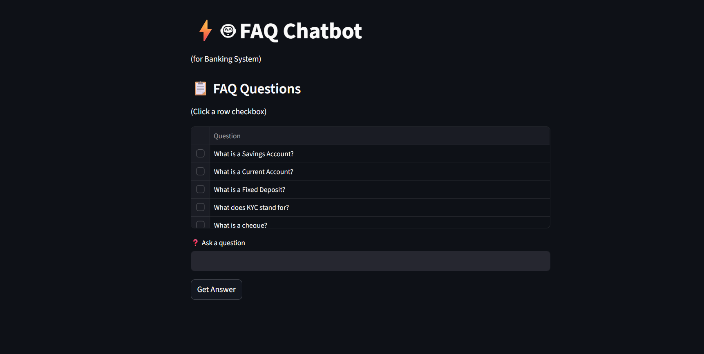
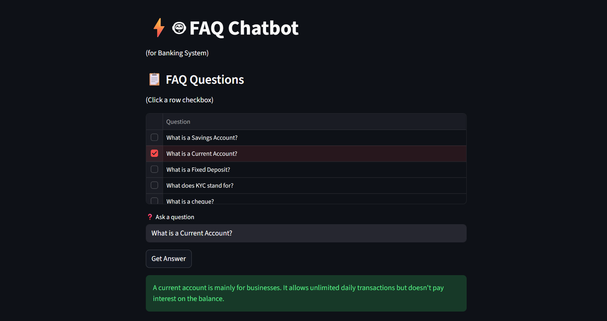

# ⚡🤖 FAQ Chatbot for Banking System

A simple FAQ Chatbot built with Streamlit, NLTK, and Scikit-learn that helps users find answers to common banking-related questions.

## Features

* Interactive web interface using Streamlit
* FAQ question selection from a table
* Natural Language Processing (NLP) with NLTK
* TF-IDF vectorization for question matching
* Cosine similarity for finding the most relevant answer
* Banking FAQ dataset support
* User-friendly interface

## Technologies Used

* Python
* Streamlit
* Pandas
* NLTK
* Scikit-learn

## Project Structure

```text
faq_chatbot/
│
├── chatbot.py
├── faq_data.csv
├── requirements.txt
└── README.md
```

## Installation

1. Clone the repository:

```bash
git clone https://github.com/your-username/faq-chatbot.git
cd faq-chatbot
```

2. Install dependencies:

```bash
pip install -r requirements.txt
```

3. Run the application:

```bash
streamlit run chatbot.py
```

## Dataset Format

Create a file named `faq_data.csv`:

```csv
Question,Answer
How can I open a bank account?,Visit the nearest branch with valid identification documents.
How do I reset my internet banking password?,Use the "Forgot Password" option on the login page.
What is the minimum balance requirement?,The minimum balance requirement depends on the account type.
```

## How It Works

1. User selects or enters a question.
2. The text is preprocessed using NLTK.
3. Questions are converted into TF-IDF vectors.
4. Cosine similarity identifies the closest FAQ match.
5. The corresponding answer is displayed.

## Future Enhancements

* Gemini AI integration for unanswered questions
* Chat history
* Voice input support
* Multi-language support
* Database integration
* Authentication and user management

## Author

Developed as a Banking FAQ Chatbot using Streamlit and Machine Learning techniques.

## Screenshots

### Home Screen


### Answer

 

## License

MIT License